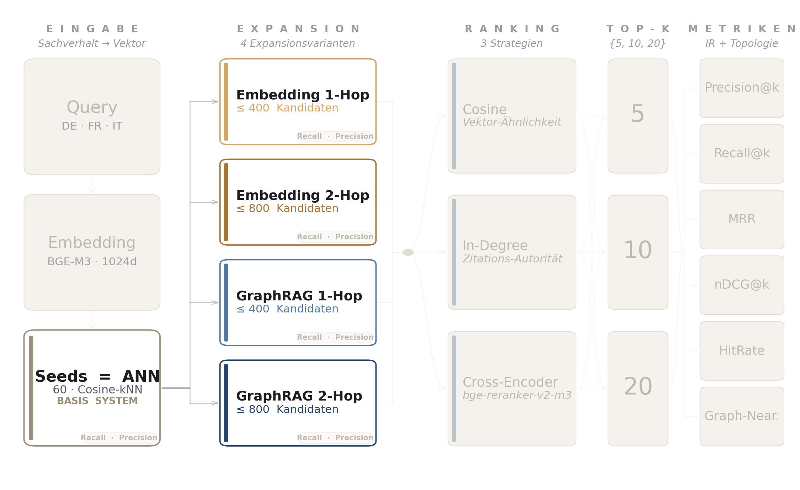
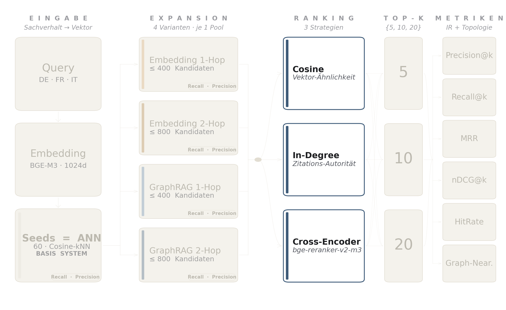

# Methodik

Der Fokus dieser Arbeit liegt auf einem relativen Architekturvergleich unter identischen Bedingungen, nicht auf absoluten Spitzen-Performance-Werten. Ziel ist eine belastbare methodische Grundlage für ein System, das stabile und reproduzierbare Resultate liefert und sich anschliessend auf einem deutlich grösseren Korpus validieren lässt. Die Stichprobengrössen sind so dimensioniert, dass die Metriken die Architekturwahl zwischen GraphRAG und Embedding-Expansion tragen. Eine breitere Einordnung in den Stand der Forschung im Legal-RAG-Bereich ist in Kapitel 2 dokumentiert.

## Datengrundlage

Die Basis für das Vektor-Retrieval bilden zwei einander ergänzende SCALE-Korpora, die gemeinsam in den Qdrant-Vektorindex eingespeist werden. `swiss_rulings` umfasst 638K Entscheide (3.3B Tokens) aus dem gesamten Bundesgerichts-Korpus [@rcdsSwissRulings2023], `swiss_leading_decisions` enthält die als Leitentscheid publizierten Bundesgerichtsentscheide aus der Amtlichen Sammlung [@rcdsSwissLeadingDecisions2023]. Beide Datensätze stammen ausschliesslich vom Bundesgericht. swiss_rulings umfasst alle BGer-Entscheide, swiss_leading_decisions markiert die Teilmenge mit BGE-Status. Im Vektorindex wird beim Retrieval entsprechend nach beiden Sources (`swiss_rulings_chunked` und `swiss_leading_decisions_chunked`) gefiltert. Der dataset-native Court-Identifier `CH_BGE` (Leitentscheid) vs. `CH_BGer` (regulärer BGer-Entscheid) bleibt im Payload erhalten und ermöglicht eine spätere Auswertung der Publikationsstatus-Heterogenität.

Der Datensatz `swiss_doc2doc_ir` umfasst 141K Entscheide mit expliziten Zitationsrelationen [@rcdsSwissDoc2docIr2023]. Diese dienen als Ground Truth für den Graphaufbau sowie als erwartete Quellen in der Evaluation. Strukturell ist der Datensatz asymmetrisch aufgebaut. Die zitierenden Entscheide, die in der vorliegenden Arbeit die Queries stellen, sind durchgängig reguläre BGer-Urteile mit Court-Tag `CH_BGer`, also Urteile, die nicht in der Amtlichen Sammlung publiziert sind. Ihre `cited_rulings`, die die Ground Truth bilden, sind dagegen durchgängig Leitentscheide mit Court-Tag `CH_BGE`. Eine empirische Stichprobenprüfung des aus dem Datensatz aufgebauten Citation-Graphen bestätigt das, von 119'039 unique citing-Decisions tragen 100 % `CH_BGer`, von 16'053 unique cited-Decisions tragen 100 % `CH_BGE`.

Diese Asymmetrie ist eine explizite Design-Entscheidung des SCALE-Benchmarks. <!--claim:C-108:start-->In Section 4.5 beschreiben Stern et al., dass das IR-Korpus aus Swiss Legislation und Leading Decisions besteht, die Queries aus SFCS-Fällen stammen, und die Ground Truth durch Extraktion zitierter Gesetze und Entscheide aus genau diesen Datensätzen gebildet wird, also ausschliesslich aus der Leitentscheid-Teilmenge der Bundesgerichts-Rechtsprechung [@sternOneLawMany2024, S. 16].<!--claim:C-108:end--> Die Aufbereitungs-Pipeline ist explizit semi-automatisch, <!--claim:C-109:start-->Stern et al. extrahieren Zitations-Labels überwiegend per Regex und HTML-Parsing aus dem Begründungstext, der durch HTML-Tags der SFCS-Quelle für föderale Fälle bereits citation-getagged ist [@sternOneLawMany2024, S. 8].<!--claim:C-109:end--> Eine weitere von den SCALE-Autoren benannte Korpus-Asymmetrie betrifft explizit die Coverage des Leitentscheid-Pools, <!--claim:C-110:start-->Stern et al. benennen in Section 4.4, dass ihre Korpus-Coverage zwar alle Leading Decisions enthält, aber nicht alle SFCS-Cases, sodass es Leitentscheid-IDs gibt, für die die volle Decision-Repräsentation fehlt ("missing critical cases exist as we have all LD but not all SFCS cases") [@sternOneLawMany2024, S. 15].<!--claim:C-110:end--> In der Schweizer Bundesgerichts-Praxis zitiert ein BGer-Urteil in seiner Begründung dagegen sowohl Leitentscheide aus der Amtlichen Sammlung (Format "BGE 145 III 72 E. 2.1") als auch nicht publizierte BGer-Urteile (Format "Urteil 4A_45/2022 vom 15. März 2022 E. 3.2"). Die Doc2Doc-IR-Aufgabe ist damit als Retrieval auf der Leitentscheid-Teilmenge der zitierten Rechtsprechung definiert, nicht als Retrieval aller zitierten Decisions.

Operativ heisst das, die Pipeline misst nicht "alle vom Ausgangsurteil zitierten Entscheide", sondern "die vom Ausgangsurteil zitierten Leitentscheide". Diese Scope-Schärfung wirkt als systematische Unterschätzung der gemessenen Werte. Retrievt die Pipeline ein unpubliziertes BGer-Urteil, das im realen Begründungstext durchaus zitiert ist, gilt der Treffer in der vorliegenden Evaluation als Fehler, weil das Label diesen Zitations-Typ nicht enthält. Die in Kapitel 5 berichteten Recall- und HitRate-Werte sind damit konservative Untergrenzen, eine Erweiterung des Labels um die nicht publizierten BGer-Zitate (etwa durch einen robusteren Citation-Extraktor auf dem Begründungstext) würde die Resultate strukturell anheben. Diese Lücke wird in Kapitel 6 als Limitation diskutiert.

Ein zweiter Unterschied zur SCALE-Original-Variante besteht in der Korpusgrösse, SCALE retrievt aus den rund 10'000 Leading Decisions plus Legislation, die vorliegende Arbeit indexiert dagegen den vollen `swiss_rulings`-Korpus mit rund 638'000 Entscheiden. Damit operiert das Retrieval auf einem rund 64-fach grösseren und entsprechend rauschhafteren Pool, ein Setup, das eher der realen produktiven Suche entspricht als das SCALE-Original. Eine Reduktion des Pools auf das Leading-Decision-Subset würde RAG und die Embedding-Varianten stark begünstigen (weil deren Top-k-Pool dann fast vollständig aus der GT-Klasse stammen würde), die GraphRAG-Varianten hingegen brechen, weil sie BGer-Seeds als Traversierungs-Substrat brauchen (die `successors`-Funktion liefert auf BGE-Seeds eine leere Menge, da Doc2Doc-IR keine BGE-als-Source-Zeilen enthält). Diese Asymmetrie zwischen den Architekturen wird in Kapitel 6 als zusätzlicher Diskussionspunkt aufgegriffen.

Eine dritte, technische Schwäche der Datengrundlage betrifft die Snapshot-Konsistenz zwischen `swiss_doc2doc_ir` und `swiss_rulings`. Eine empirische Prüfung über alle 141'341 Doc2Doc-Source-Decisions zeigt, dass 14 % der Source-IDs (20'446) nicht in unserem Qdrant-Index aufzufinden sind, ebenso 30.6 % der unique GT-Leitentscheide (4'914 von 16'053). Diese Lücken werden über den strict-GT-Filter sauber aus dem finalen Evaluationssatz herausgefiltert (alle 12'678 finalen Queries sind in Qdrant abgebildet, sämtliche ihrer GT-Decisions ebenfalls), sie reduzieren aber die nutzbare Stichprobengrösse vor der Stratifizierung deutlich. Insbesondere für Italienisch limitiert das die maximal symmetrisch ziehbare Stichprobe auf 4'226 Queries pro Sprache. Eine Korpus-Erweiterung um die fehlenden BGer-Snapshots wäre der naheliegende nächste Schritt, um die Stichprobe pro Sprache zu vergrössern.

Auch `swiss_doc2doc_ir` besteht ausschliesslich aus Bundesgerichts-Entscheiden, der Datensatz enthält keine kantonalen oder regionalen Entscheide. Die in Kapitel 1 als Scope-Reduktion benannte Beschränkung auf die Gerichtsinstanz Bundesgericht ist damit eine direkte Folge der Datenverfügbarkeit im SCALE-Benchmark.

Die Wahl, den vollen swiss_rulings-Korpus zu indexieren und nicht nur die 141K doc2doc_ir-Entscheide, ist bewusst. Der Retrieval-Pool soll realistischerweise alle BGer-Entscheide umfassen, auch jene ohne maschinenlesbare Zitations-Labels, weil ein produktives System diese ebenso als Kandidaten vorschlagen können soll. Die Auswertung selbst wird über den strict-GT-Filter (siehe Abschnitt zur Ground-Truth-Validität) auf jene Queries beschränkt, deren Ground Truth vollständig im Index liegt. Die Retrieval-Bandbreite bleibt aber gross. Für die graph-basierten Systeme bedeutet das, dass Cosine-Seeds ausserhalb des Citation-Graphen zwar als Vektor-Kandidaten erhalten bleiben, aber nicht zur Graph-Expansion beitragen.

Das Korpus `swiss_legislation` mit 36K Gesetzestexten [@rcdsSwissLegislation2023] ist in der vorliegenden Arbeit nicht evaluiert. Der Fokus liegt ausschliesslich auf Case-Law-Retrieval, also dem Auffinden zitierter Gerichtsentscheide (`cited_rulings`). Die Gesetzes-Retrieval-Aufgabe (`cited_laws`) bleibt als naheliegender Erweiterungsschritt im Ausblick (Kapitel 7) benannt.

## Evaluationsmethodik

Die Evaluation fokussiert auf Retrieval-Qualität und ist in fünf Pipeline-Stufen gegliedert, Query und Ground Truth, Retrieval-Systeme, Ranking, Top-k und Metriken.

### Query und Ground Truth

{ width=95% }

Query ist der Sachverhalt (Facts) des Ausgangsentscheids, also eines regulären BGer-Urteils (`CH_BGer`). Die Ground Truth stammt aus swiss_doc2doc_ir [@rcdsSwissDoc2docIr2023] und besteht aus den zitierten Leitentscheiden des Ausgangsentscheids (`cited_rulings`-Feld, Court-Tag `CH_BGE`). Operativ heisst das, die Pipeline soll aus einem BGer-Sachverhalt die zur Begründung herangezogenen Leitentscheide retrievieren. Unpublizierte BGer-Urteile, die im echten Begründungstext ebenfalls zitiert werden, sind im Label nicht erfasst (vgl. Datengrundlage). Das im selben Datensatz vorhandene Feld cited_laws wird nicht ausgewertet, weil sich die Arbeit ausschliesslich auf Case-Law-Retrieval beschränkt (siehe Datengrundlage und Ausblick in Kapitel 7).

### Retrieval-Systeme

{ width=95% }

Allen fünf Systemen gemeinsam sind 60 ANN-Seeds aus Qdrant, die zugleich die RAG-Baseline bilden. Die vier Expansionsvarianten Embedding-1Hop, Embedding-2Hop, GraphRAG-1Hop und GraphRAG-2Hop erweitern diese Seedmenge nach unterschiedlichen Prinzipien. Self-Exclusion des Query-Dokuments und temporaler Closed-World-Filter sichern die Evaluationsvalidität und werden im Abschnitt zur Ground-Truth-Validität begründet.

Pool-Grössen-Confound und Kontrollbedingung. RAG selektiert seine Top-k unmittelbar aus den 60 Seeds, die vier Expansionsvarianten erweitern diese Seedmenge auf einen grösseren Pool (Cap 400 bei 1-Hop, Cap 800 bei 2-Hop). Schon ein zufälliges Ranking trifft in einem grösseren Pool mit höherer Wahrscheinlichkeit auf einen Ground-Truth-Entscheid. Ein direkter Vergleich GraphRAG-1Hop gegen RAG wäre damit doppelt motiviert, einmal durch die Graphstruktur und einmal durch die schlichte Pool-Erweiterung. Das Studiendesign trennt die beiden Effekte über ein matched-cap Kontrollpaar. Embedding-1Hop und Embedding-2Hop erweitern dieselben 60 Seeds über kNN-Nachbarschaft im Embedding-Raum, mit identischen Pool-Caps von 400 bzw. 800. Damit ergibt sich ein 2×3-Vergleichsdesign mit RAG als gemeinsamer Baseline.

| | Keine Expansion | 1-Hop (Cap 400) | 2-Hop (Cap 800) |
|---|---|---|---|
| Embedding-Raum | RAG (60 Seeds) | Embedding-1Hop | Embedding-2Hop |
| Zitationsgraph | — | GraphRAG-1Hop | GraphRAG-2Hop |

Table: 2x3-Vergleichsdesign der fünf Retrieval-Systeme mit matched-cap Kontrollbedingung.

Die paarweisen Vergleiche bei identischer Pool-Grösse, also Embedding-1Hop gegen GraphRAG-1Hop und Embedding-2Hop gegen GraphRAG-2Hop, isolieren den Mehrwert der Graphstruktur. Erst wenn GraphRAG-Systeme deutlich besser abschneiden als ihre Embedding-Pendants, kann der Mehrwert der Zitationsrelationen als belegt gelten.

#### Pool-Qualität

{ width=95% }

Zusätzlich zu den nachgelagerten Ranking-Metriken werden auf jeder der vier Expansionsarchitekturen zwei Pool-Qualitätsmetriken ausgewiesen. Das Recall-Ceiling misst den Anteil der Ground-Truth-Entscheide, die sich überhaupt im Kandidatenpool befinden, und ist die obere Grenze dessen, was ein perfektes Ranking erreichen könnte. Das Precision-Ceiling misst, wie dicht die Ground Truth im Pool liegt, also den Anteil der Ground-Truth-Entscheide an der Gesamtzahl der Kandidaten, und beschreibt damit, wie schwer es das nachgelagerte Ranking hat, die Treffer herauszufinden. Beide werden in Kapitel 5 entlang des matched-cap Kontrollpaars (Embedding-1Hop gegen GraphRAG-1Hop und Embedding-2Hop gegen GraphRAG-2Hop) verglichen.

Zur Lokalisierung von Recall-Verlusten innerhalb der Pipeline wird das Recall-Ceiling zusätzlich stufenweise an vier Schnittstellen einer Expansion gemessen, `seeds` (die ANN-Ergebnisse aus Qdrant), `raw` (Seeds plus alle Expansions-Nachbarn vor jeder Filterung), `post_temporal` (nach Anwendung des temporalen Closed-World-Filters) und `post_cap` (nach Beschneidung auf die konfigurierte Pool-Grösse). Diese Waterfall-Sicht erlaubt drei diagnostische Aussagen, die das Aggregat alleine nicht liefert. Der Ceiling-Zuwachs zwischen `seeds` und `raw` quantifiziert den Beitrag des Expansionsprinzips zur Kandidatenqualität, der Ceiling-Verlust zwischen `raw` und `post_temporal` misst die durch retrospektive Zitationen verlorenen Treffer, und der Verlust zwischen `post_temporal` und `post_cap` zeigt, ob das Pool-Cap relevante Kandidaten verwirft. Die in Kapitel 5 berichteten Recall- und Precision-Ceilings verwenden ausschliesslich die `post_cap`-Stufe, also den Pool, den das Ranking tatsächlich sieht.

### Ranking

{ width=95% }

Drei Ranking-Strategien werden einheitlich auf alle fünf Systeme angewendet und decken drei unterschiedliche Relevanzsignale ab. Cosine Similarity misst semantische Ähnlichkeit zwischen Query und Kandidat. In-Degree zählt, wie häufig ein Kandidat im Korpus zitiert wird, und bildet damit Zitations-Autorität ab. Der Cross-Encoder bewertet Query und Kandidat in einem gemeinsamen Forward-Pass und liefert dabei einen feinkörnigeren Score als die unabhängig vorberechneten Bi-Encoder-Vektoren (vgl. Kapitel 2).

Vorab sei angemerkt, dass Cosine in dieser Arbeit primär als triviale Baseline mitläuft. Eine eigene Voruntersuchung auf den 12'678 Bundesgerichts-Queries zeigt, dass die Cosine-Differenz zwischen zitierten und zufälligen Entscheiden im BGE-M3-Embedding-Raum unter 0.001 liegt. Cosine ist als Ranking-Signal zwischen den Architekturen damit empirisch nicht diskriminativ, die Strategie wird der Vollständigkeit halber berichtet und die Quantifizierung findet sich in Kapitel 5.

Die Aufnahme von In-Degree als eigenständige Achse neben den zwei text-basierten Signalen stützt sich auf Vorbefunde aus der Legal-IR-Literatur. <!--claim:C-082:start-->Stern et al. zeigen für das Schweizer Bundesgericht, dass nur rund 3.4 Prozent aller Entscheide (2'542 von 74'799 Fällen im Train-Set) als Leitentscheid publiziert werden, und nutzen die Anzahl der Zitate, die ein Entscheid in späteren Urteilen erhält, als Mass für seinen Einfluss auf die spätere Rechtsprechung [@sternCitationsCriticality2024, S. 2-3].<!--claim:C-082:end--> <!--claim:C-083:start-->Milz et al. beobachten für das deutsche Rechtssystem ein verwandtes Muster, einige wenige Entscheide ziehen sehr viele Zitate auf sich, die grosse Mehrheit fast keine, und je mehr Zitate ein Entscheid schon hat, desto wahrscheinlicher kommen neue dazu [@milzAnalysisGermanLegal2021, S. 4].<!--claim:C-083:end--> In-Degree greift genau diese Häufigkeit als Signal auf und ergänzt damit eine Dimension, die ein reines Text-Ähnlichkeitsmass nicht erfasst. Die Indegree-Zahl wird logarithmisch in einen Ranking-Score überführt, `score = log(1 + indegree)`, was die schwer-rechtsschiefe Verteilung der Korpus-Indegrees (wenige Leitentscheide mit sehr hohem Indegree, lange Long-Tail bei den meisten Entscheiden) auf eine ranking-freundliche Skala bringt und die Wirkung sehr autoritativer Entscheide gegenüber moderat zitierten dämpft. Eine erste Variante verwendete den Indegree multiplikativ als Faktor auf den Cosine-Score. Da Graph-Expansion-Kandidaten ohne eigenen Cosine-Score in den Pool gelangen, setzte das ihren Ranking-Score systematisch auf null und entwertete den GraphRAG-Pfad künstlich. Die hier verwendete logarithmische additive Variante behebt diesen Effekt, indem der Indegree als eigenständiges Ranking-Signal in seinen log-Werteraum überführt wird.

Als Cross-Encoder kommt `BAAI/bge-reranker-v2-m3` zum Einsatz [@baaiBGERerankerV2M32024; @chenBGEM3EmbeddingMultilingual2024], ein multilinguales Modell aus derselben Familie wie das Embedding-Modell BGE-M3. Die Modellfamilien-Konsistenz ist methodisch wertvoll, weil sowohl die initiale ANN-Seed-Selektion als auch das Reranking in einem semantisch kalibrierten Raum operieren. Eine erste Konfiguration verwendete `cross-encoder/ms-marco-MiniLM-L-6-v2` [@wangMiniLMDeepSelfAttention2020], erwies sich aber für die drei Schweizer Amtssprachen als systematisch suboptimal, weil MS-MARCO ein englischsprachiger Web-Suchbenchmark ist. Im Vorlauf zeigten französische und italienische Queries unter diesem Modell einen messbar grösseren Recall-Abstand zu deutschen Queries als unter den anderen Ranking-Strategien.

### Top-k

{ width=95% }

Für faire Vergleichbarkeit retrieven alle Systeme exakt k Dokumente, mit k ∈ {5, 10, 15, 20}. Die Auswertung erfolgt stratifiziert nach Sprache (Deutsch, Französisch, Italienisch). Eine zusätzliche Aufschlüsselung nach Gerichtsebene ist mit dem verwendeten Doc2Doc-IR-Korpus nicht durchführbar, weil der Datensatz ausschliesslich Bundesgerichtsentscheide enthält (ausführliche Begründung in Kapitel 1).

### Metriken

{ width=95% }

Die Retrieval-Systeme werden hinsichtlich folgender, in Kapitel 2 eingeführten Metriken verglichen.

| Metrik | Beschreibung | Wertebereich |
|--------|-------------|--------------|
| Precision@k | Anteil korrekter Dokumente unter den Top-k Resultaten | [0, 1] |
| Recall@k | Anteil der Ground-Truth-Dokumente unter den Top-k Resultaten | [0, 1] |
| HitRate@k | Anteil der Queries mit mindestens einem korrekten Dokument in den Top-k (binäre Per-Query-Metrik) | [0, 1] |
| MRR | Reziproke Position des ersten korrekten Dokuments im Ranking | (0, 1] |
| NDCG@k | Ranking-Qualität mit positionsbasierter Gewichtung | [0, 1] |
| Graph-Nearness | Mittlere topologische Nähe $1/(1+d)$ retrievter Dokumente zur nächstgelegenen Ground Truth im Zitationsgraphen | [0, 1] |

Table: Übersicht der eingesetzten Retrieval-Metriken.

#### Graph-Nearness

Als neuartiges Evaluationsmass wird Graph-Nearness eingeführt. Statt Retrieval-Fehler binär zu werten, misst Graph-Nearness die strukturelle Distanz $d$ zwischen einem retrievten Dokument und dem nächstgelegenen Ground-Truth-Knoten und transformiert sie durch $1/(1+d)$ in einen Score zwischen 0 und 1. Die Distanz wird auf dem gerichteten Citation-Graphen in citing → cited Richtung gemessen, weil das Mass die manuelle Navigations-Distanz eines Nutzers abbildet, der vom retrievten Treffer ausgehend über dessen zitierte Vorentscheide auf den Ground-Truth-Entscheid stösst. Diese Vorwärts-Navigation entspricht dem klassischen Recherche-Workflow im Bundesgerichts-Kontext, ein Jurist liest einen Entscheid und folgt dessen Zitationen auf die zugrundeliegenden Präjudizien. Die rückwärtige Lookup-Richtung (welche späteren Entscheide zitieren den Treffer) erfordert ein zusätzliches Citator-Werkzeug und wird hier bewusst nicht in die Distanz-Berechnung einbezogen, weil sie nicht zum unmittelbaren Lese-Workflow gehört. Ein exakter Treffer ($d=0$) liefert den Beitrag 1, ein direkter Zitations-Nachbar ($d=1$) den Beitrag 0.5, ein Nachbar-eines-Nachbarn ($d=2$) den Beitrag 0.33 und ein unverbundener Knoten den Beitrag 0. Die pro Query gemittelten Werte werden arithmetisch über alle Queries aggregiert.

Ein Beispiel veranschaulicht das Prinzip. Ruft ein System statt der Ground-Truth-Entscheidung BGE 139 III 391 die Entscheidung BGE 139 III 500 ab, die BGE 391 im Graphen direkt zitiert, beträgt der Beitrag 0.5. Liegt zwischen beiden Entscheidungen keine Zitationsverbindung, beträgt der Beitrag 0. Daraus folgt die Hypothese, dass GraphRAG nicht nur mehr korrekte Dokumente liefert, sondern auch bei Fehlern juristisch näher an der Ground Truth bleibt als Standard-RAG.

{ width=95% }

### Ground-Truth-Validität

Die Ground Truth dieser Arbeit sind die im SCALE-Datensatz pro Query aufgeführten cited_rulings, also die vom Ausgangsentscheid zitierten Bundesgerichtsentscheide [@rcdsSwissDoc2docIr2023; @sternOneLawMany2024]. Damit der Architekturvergleich auf diesen Labels valide bleibt, sind drei Bedingungen nötig.

Der strikte GT-Konsistenzfilter behält eine Query nur dann im Evaluations-Set, wenn jeder ihrer Ground-Truth-Entscheide sowohl im Qdrant-Index als auch im Zitationsgraphen vorhanden ist. Formal sei $V$ die Menge aller `decision_id` im Qdrant-Index und $G$ die Menge aller Knoten im Citation-Graph mit `source=ruling`. Dann ist die Menge der für die Evaluation zulässigen Entscheide $I_{valid} = V \cap G$. Eine Query bleibt im Evaluations-Set, wenn $q \in I_{valid}$ und jeder ihrer Ground-Truth-Entscheide ebenfalls in $I_{valid}$ liegt. Wäre ein zitierter Entscheid in einem der beiden Systeme nicht abgebildet, könnte ihn das Retrieval prinzipiell nicht finden, und die Metrik würde Infrastruktur-Lücken als Architektur-Schwäche missdeuten. Nach diesem Filter und der zusätzlichen Anforderung an nicht-leere `facts`-Texte verbleiben 73'331 valide Queries (Deutsch 41'906, Französisch 27'199, Italienisch 4'226). Aus dieser Grundgesamtheit wird die finale Stichprobe von je 4'226 Queries pro Sprache stratifiziert gezogen. Italienisch ist mit 4'226 das limitierende Sprachvolumen und definiert damit das absolute Maximum einer sprach-symmetrischen Ziehung.

Der Selbstausschluss entfernt den Query-Entscheid aus seinem eigenen Seed-Pool. Der Query-Text stammt aus jenem Bundesgerichtsentscheid, dessen cited_rulings die Ground Truth bilden. Derselbe Entscheid liegt als Chunk im Vektorindex und liefert sich selbst als Top-Treffer der ANN-Suche. Die anschliessende Graph-Expansion seiner Nachbarn ergibt dann tautologisch die Ground Truth. Eine erste Pipeline-Version litt unter diesem Leck mit einem Recall-Ceiling nahe 99 Prozent. Die Korrektur schliesst den Query-Entscheid serverseitig aus dem Seed-Pool aus.

Der temporale Closed-World-Filter setzt die juristische Zeitrichtung in die Pipeline um. Ein Bundesgerichtsentscheid kann nur frühere Entscheide zitieren. Würden Seeds oder Expansionskandidaten mit einem Datum nach dem Query-Datum zugelassen, könnte ein späterer Entscheid als Brücke auf einen vor der Query liegenden Kandidaten wirken und so einen Closed-World-Bruch erzeugen. Der Filter wird konsistent auf Seeds und auf alle Expansionsstufen angewendet.

Die konkrete Umsetzung der drei Filter, also die serverseitigen Qdrant-Payload-Filter, die Migration des Datumsfeldes auf einen indizierten Integer-Typ und das Validierungs-Audit, ist in Kapitel 4 dokumentiert. Die Limitation, dass Gerichtszitationen nicht alle juristisch relevanten Quellen erfassen, wird in Kapitel 6 diskutiert.

### Hypothesen

Die in Kapitel 1 formulierte Forschungsfrage operationalisiert sich über drei testbare Hypothesen, die jeweils auf das matched-cap Vergleichsdesign abgestellt sind.

H1 Pool-Recall. GraphRAG-1Hop erreicht bei gleichem temporalen Filter und gleicher Pool-Obergrenze ein höheres Recall-Ceiling als Embedding-1Hop. Operationalisiert über den direkten Vergleich der Recall-Ceilings in Kapitel 5.

H2 Hop-Sättigung. Eine zweite Traversierungsebene (GraphRAG-2Hop) liefert kein substanziell höheres Recall-Ceiling als die erste, sondern verdünnt die Pool-Dichte. Operationalisiert über das Verhältnis von Recall-Ceiling-Zuwachs zu Pool-Wachstum von 1Hop auf 2Hop.

H3 Fehlerqualität. Fehltreffer der GraphRAG-Systeme liegen topologisch näher an der Ground Truth als Fehltreffer der Embedding-Systeme oder der RAG-Baseline. Operationalisiert über die Graph-Nearness und die Verteilung der Retrieved-zu-GT-Distanzen.

### Adversarialer Pipeline-Audit

Ein erster vollständiger Lauf zeigte einen rund 33-fachen Recall-Ceiling-Abstand zwischen GraphRAG-1Hop und Embedding-1Hop bei vergleichbarer Pool-Grösse. Weil dieser Befund die zentrale These der Arbeit stark stützt, wurde vor der inhaltlichen Interpretation ein adversariales Pipeline-Audit mit der expliziten Annahme durchgeführt, dass die Zahlen ein Implementationsartefakt sein könnten. Geprüft wurden vier Klassen möglicher Verzerrung, ID-Konsistenz zwischen Kandidaten-Pool und Ground Truth, Selbstausschluss-Symmetrie zwischen den fünf Architekturen, Konsistenz der Recall-Ceiling-Berechnung gegen unabhängige Per-Layer-Traces und Symmetrie des Pool-Aufbaus über alle Expansionsoperationen. Die im Audit identifizierten Defekte sind in Kapitel 4 dokumentiert und vor dem finalen kanonischen Lauf behoben. Nach den Korrekturen schrumpft der Ceiling-Abstand von 33-fach auf rund elffach, der relative Architekturbefund bleibt damit erhalten und ist nicht das Resultat einer fehlerhaften Implementation.

