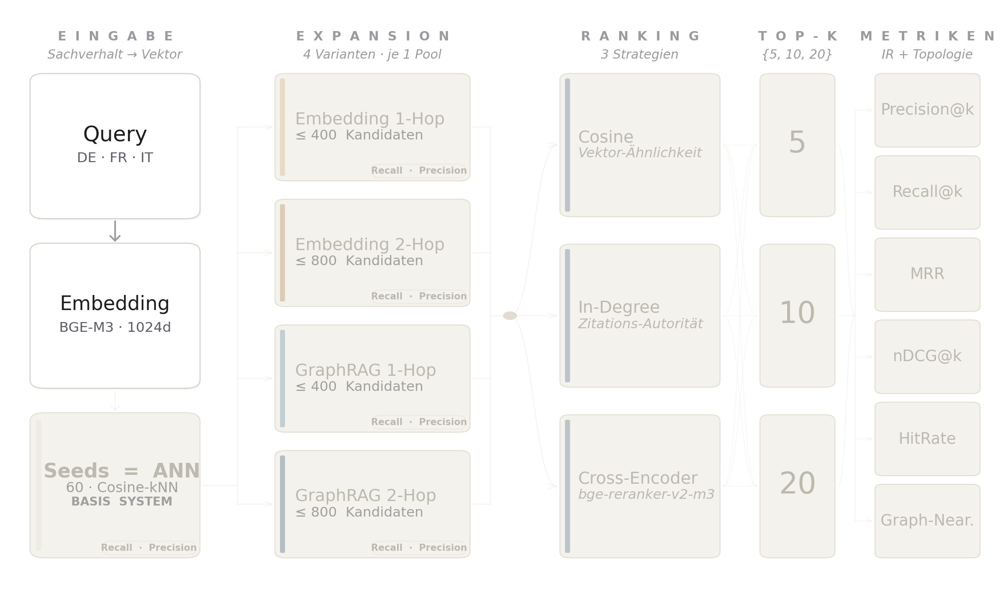
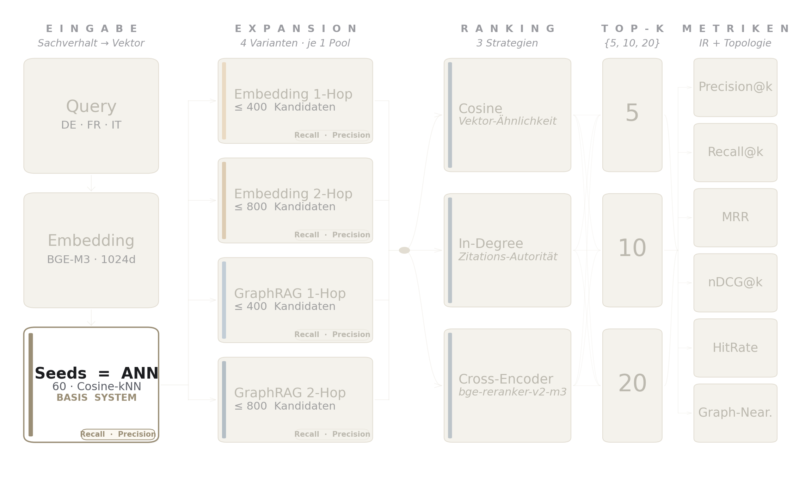
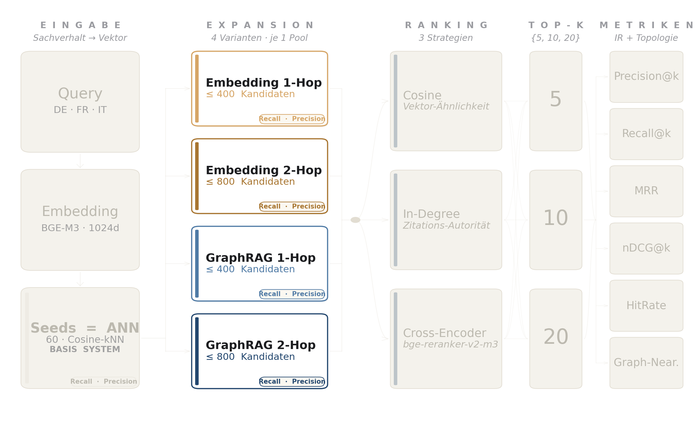
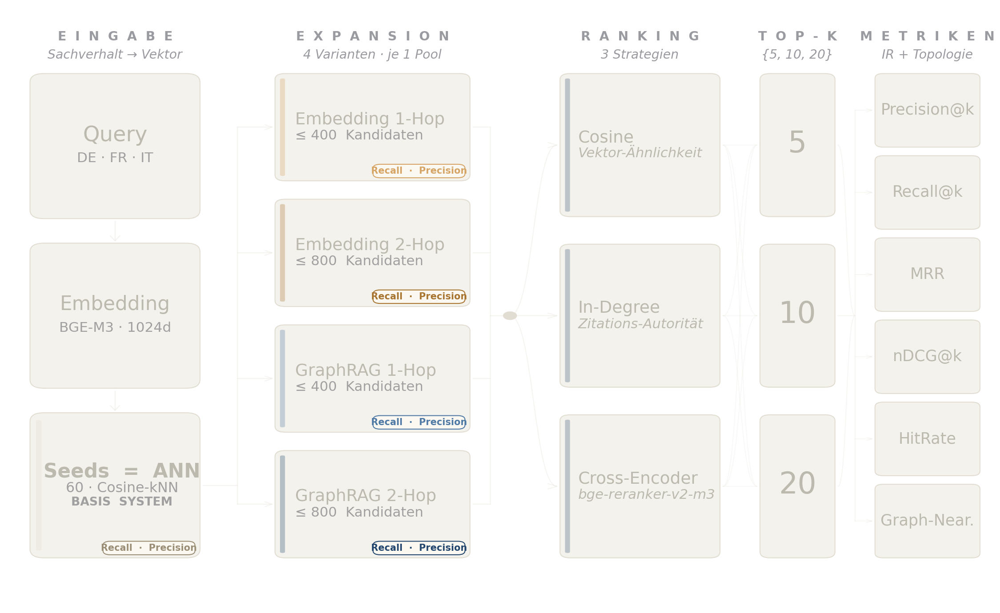
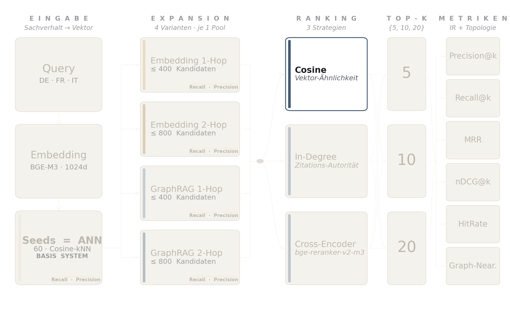
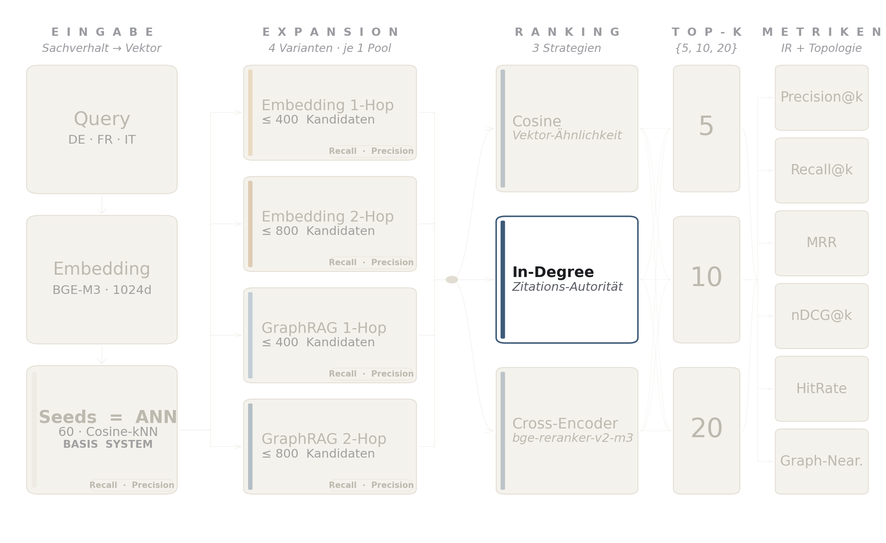
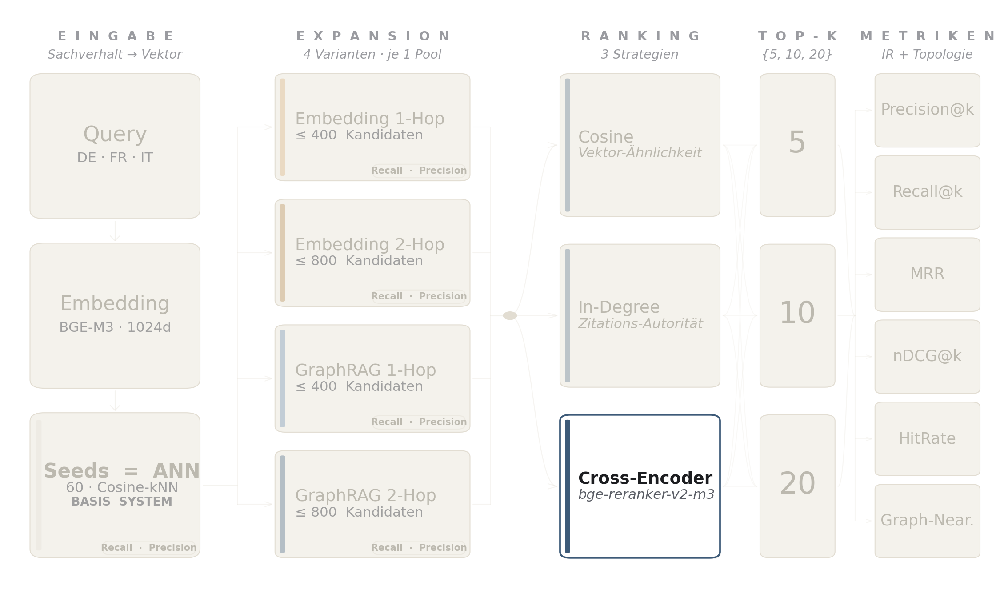
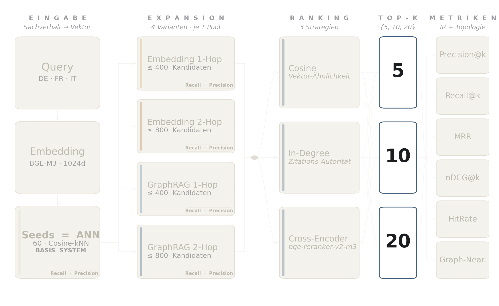
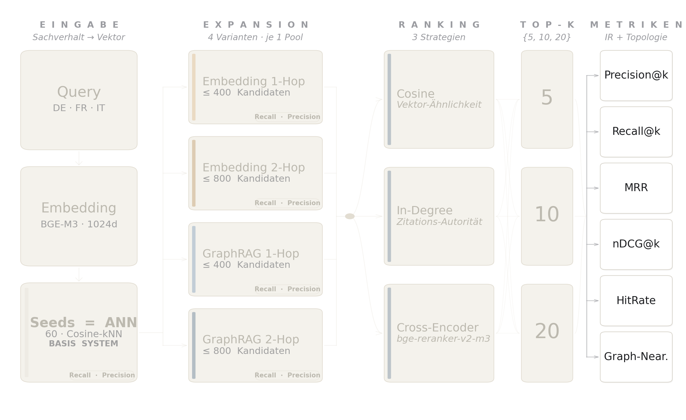

# Implementation

Die in Kapitel 3 definierte Pipeline läuft über fünf Retrieval-Pfade, drei Ranking-Strategien und drei k-Stufen unter identischen Bedingungen. Dieses Kapitel beschreibt die konkrete Umsetzung entlang der Karten der Pipeline-Übersicht in Lesereihenfolge. Vorangestellt sind zwei Querschnittsabschnitte zum Service-Layer und zum Citation Graph, weil beide an mehreren Stellen der Pipeline gleichzeitig wirken und sonst dreifach erklärt werden müssten.

Die Arbeit ist als Open-Source-Projekt aufgesetzt. Alle im Folgenden referenzierten Skripte, Konfigurationen und Auswertungs-Notebooks liegen im Repository unter `scripts/eval/` und `webui/` und lassen sich dort vollständig nachvollziehen. Wo der Text auf eine konkrete Funktion oder ein Skript Bezug nimmt, ist der Pfad im Repository in `code`-Schrift angegeben.

## Service-Layer und Hardware

Die Evaluations-Infrastruktur trennt modellgebundene Dienste von der Pipeline-Logik. Modelle laufen als langlaufende HTTP-Services, die Pipeline selbst ist ein reiner Netzwerk-Client. Dadurch lässt sich der Pipeline-Code lokal entwickeln, neu starten und debuggen, ohne die kostspielig zu initialisierenden Modelle bei jeder Iteration neu zu laden.

Der Retrieval-Stack besteht aus drei Diensten.

- Qdrant als Vektorindex für die rund drei Millionen BGE-M3-Embeddings der Korpus-Chunks, mit Cosine Similarity, HNSW als ANN-Algorithmus [@vasnetsovFilterableHNSW2019] und Payload-basiertem Filtering für Sprache und Datum.
- Text-Embeddings-Inference (TEI) von HuggingFace [@huggingfaceTextEmbeddingsInference] für Query-Embeddings zur Laufzeit, eine Instanz mit dem Modell `BAAI/bge-m3` [@chenBGEM3EmbeddingMultilingual2024].
- TEI für das Cross-Encoder-Modell `BAAI/bge-reranker-v2-m3` [@baaiBGERerankerV2M32024] über den `/rerank`-Endpunkt, ausgerollt als acht parallel angesprochene Replicas (eine pro GPU).

Alle Dienste laufen als Container in einem Kubernetes-Cluster, das auch das GPU-Scheduling übernimmt. Der Retrieval-Stack belegt acht NVIDIA RTX 3090 GPUs mit je 24 GB VRAM. Auf sieben GPUs läuft je eine dedizierte Cross-Encoder-Replica, auf der achten ist zusätzlich die Embedding-Instanz colociert. Der Citation Graph liegt nicht als eigener Service vor, sondern wird beim Pipeline-Start als gepickelter NetworkX-Graph in den Hauptspeicher geladen (siehe nächster Abschnitt).

### Pipeline und Control-UI

Die Evaluations-Pipeline ist Python-basiert und besteht aus drei Stages, Stichprobenziehung (`01_sample_queries.py`), Retrieval (`02_run_retrieval.py`) und Metrik-Berechnung (`03_compute_metrics.py`). Eine darüberliegende FastAPI-Web-UI mit Server-Sent-Events erlaubt die Konfiguration, das Live-Logging und das Abbrechen einzelner Stages und persistiert jeden Lauf mit Konfiguration, Stdout und Exit-Code in einer SQLite-Datenbank. Diese Audit-Trail-Eigenschaft ist für die Reproduzierbarkeit zentral, jede in der Arbeit referenzierte Metrik lässt sich auf einen identifizierbaren Lauf zurückführen.

## Citation Graph

Der Knowledge Graph wird einmalig offline aus dem Datensatz `rcds/swiss_doc2doc_ir` [@rcdsSwissDoc2docIr2023] aufgebaut. Als Datenstruktur kommt ein gerichteter Graph aus der Bibliothek NetworkX (`networkx.DiGraph`) zum Einsatz. Die Wahl ist pragmatisch, der Graph hat rund 159'000 Knoten und 1.6 Millionen Kanten, passt in den Hauptspeicher und benötigt keine eigenständige Graphdatenbank. Die fertige Graph-Datei (`citation_graph.pkl`, rund 150 MB) ist per Git LFS im Repository eingecheckt, eine Reproduktion braucht keinen Neubau.

Der Build-Prozess (`scripts/eval/build_citation_graph.py`) iteriert über die Shards des Datensatzes und legt pro Zeile drei Arten von Einträgen an.

- Ruling-Knoten für die `decision_id` des Quellentscheids mit dem Attribut `source=ruling`.
- `case_to_case`-Kanten für jeden Eintrag in `cited_rulings`, gerichtet vom zitierenden zum zitierten Entscheid. Fehlt ein Zielknoten noch im Graphen (out-of-corpus zitierter Entscheid), wird er ebenfalls als Ruling-Knoten angelegt.
- `case_to_law`-Kanten für jeden Eintrag in `laws`. Der Zielknoten erhält das Attribut `source=law`, sofern er noch nicht als Ruling existiert.

{ width=70% }

Die Kantenrichtung citing → cited ist eine bewusste Konvention. `graph.successors(decision_id)` liefert direkt die von einem Entscheid zitierten Dokumente, `graph.predecessors(decision_id)` die zitierenden Entscheide, was dem Indegree und damit dem klassischen Mass juristischer Autorität entspricht.

Der fertige Graph wird als Binär-Datei `citation_graph.pkl` (rund 150 MB) abgelegt. Dieses Artefakt ist die einzige Schnittstelle der Evaluations-Pipeline zum ursprünglichen HuggingFace-Datensatz. Nach dem Build kann die Pipeline vollständig ohne die HuggingFace-Bibliothek laufen.

Statistiken des fertigen Graphen sind 158'881 Knoten (157'394 Rulings, 1'487 Gesetzesartikel) und 1'601'332 gerichtete Kanten (821'620 `case_to_case`, 779'712 `case_to_law`). Diese Zahlen bilden die Grundlage für die strikte GT-Filterung in Kapitel 3, nur Entscheide, die sowohl im Vektorindex als auch im Graphen vorkommen ($I_{\text{valid}} = V \cap G$, 131'734 IDs), sind im Eval-Set zugelassen.

Die `case_to_law`-Kanten sind im fertigen `.pkl` vollständig enthalten, werden aber in dieser Arbeit nicht ausgewertet. Der `cited_laws`-Ausblick steht in Kapitel 7.

## Eingabe, Query und Embedding-Service

{ width=95% }

Als Embedding-Modell wird `BAAI/bge-m3` eingesetzt, ein multilinguales Modell mit 1024 Dimensionen [@chenBGEM3EmbeddingMultilingual2024]. Die Chunking-Strategie für den Korpus-Index nutzt 1024 Tokens pro Chunk mit 128 Tokens Overlap. Die Wahl eines multilingualen Modells ist zentral für die Abdeckung der drei Schweizer Amtssprachen Deutsch, Französisch und Italienisch und gilt sowohl für den Korpus-Index als auch für die Query-Embeddings zur Laufzeit.

Die Stichprobenziehung in Stage 1 ruft das Modell nicht selbst auf, sie zieht die Query-Texte und ihre Ground-Truth-Entscheide aus zwei lokalen Artefakten. In einer früheren Version der Pipeline wurde bei jedem Lauf der komplette HuggingFace-Datensatz `rcds/swiss_doc2doc_ir` geladen, nur um daraus die Query-Texte und die zitierten Entscheide herauszuziehen. Das ist nicht nötig, diese Information steckt bereits im Knowledge Graph (siehe vorheriger Abschnitt) und in den Qdrant-Chunks. Der Graph hält die Zitationsbeziehungen als Kanten (`case_to_case`, `case_to_law`), und Qdrant liefert die Chunk-Texte sowie Sprach- und Datumsmetadaten. Die Stichprobenziehung greift seitdem nur noch auf diese zwei lokalen Artefakte zu, die HuggingFace-Library wird einmalig beim Graph-Build verwendet und zur Laufzeit nicht mehr benötigt.

Die in Kapitel 3 beschriebene strikte GT-Konsistenz wird in Stage 1 operativ über das vorberechnete Artefakt `valid_ids.json` umgesetzt, eine JSON-Liste der 131'734 Decision-IDs des Schnitts $V \cap G$. Stage 1 sampelt Query-Kandidaten ausschliesslich aus dieser Liste, und beim Aufbau der Ground-Truth-Liste pro Query wird jeder über `case_to_case` erreichbare Zielknoten erneut gegen `valid_ids` sowie gegen das vorberechnete Datums-Artefakt `date_index.json` (Bedingung `cited_date < query_date_ms`) gefiltert. Damit ist per Konstruktion garantiert, dass jede zur Auswertung gelangende Ground-Truth-Decision sowohl im Qdrant-Index als auch im Graphen vorhanden und temporal zulässig ist. Queries ohne mindestens einen verbleibenden Ground-Truth-Treffer nach diesem Filter werden aus dem Kandidaten-Pool entfernt.

Stage 1 zieht den `query_text` aus dem `facts`-Feld und kappt ihn bei 4096 Whitespace-Tokens, ein Cap, das bei nur 9 von 12'678 Queries greift. Das Cap ist so gewählt, dass der BPE-tokenisierte Query-Text (Ratio rund 1.5x) zusammen mit dem auf 1024 BPE begrenzten Cross-Encoder-Candidate sicher unter der 8192-BPE-Pair-Grenze des Reranker-Modells bleibt.

Die Query-Embeddings werden in Stage 2 erzeugt. Pro Query wird die TEI-Embed-Instanz einmal angefragt und liefert einen einzelnen 1024-dimensionalen Vektor, der direkt in die ANN-Seed-Suche geht. Multi-Vektor-Strategien (z.B. ColBERT) kommen nicht zum Einsatz.

## Seeds, ANN-Retrieval und Closed-World-Filter

{ width=95% }

Die 60 ANN-Seeds bilden die Basis für alle fünf Architekturen. RAG liest aus dem Seed-Pool direkt seine Top-k-Antworten, die vier Expansionsvarianten benutzen die Seeds als Aufsetzpunkt für die nachfolgende Pool-Erweiterung. Qdrant beantwortet jede Seed-Anfrage über einen HNSW-Index mit Cosine Similarity als Distanzfunktion und führt zwei serverseitige Payload-Filter direkt am Traversierungspfad mit.

Damit pro Query verlässlich 60 unique Decisions als Seeds zurückkommen, fragt der Qdrant-Aufruf bei aktivem temporalen Filter 720 Chunks an (12-facher Over-Fetch). Die rohen Chunk-Treffer werden nach `decision_id` dedupliziert und auf die Top-60 Decisions trunkiert. Der Over-Fetch kompensiert die Chunk-Multiplicity und den temporalen Filter.

Drei Payload-Felder werden in der Pipeline als serverseitige Qdrant-Filter eingesetzt, sodass nicht zulässige Kandidaten gar nicht erst in den Pool gelangen.

- `source` trennt Rulings, Leading-Decisions und Gesetzestexte. Der Filter `source=ruling` wirkt im Seed-Step und in der kNN-Expansion.
- `date_ms` ist ein indizierter Integer-Zeitstempel. Der Range-Filter `date_ms < query_date_ms` setzt die juristische Zeitrichtung am Qdrant-Traversal um.
- `decision_id` wird als Ausschlussfilter im Seed-Step gesetzt (`must_not decision_id == query_id`), womit sich die Query-Decision nicht selbst als Top-Treffer liefern kann.

Die filterbare HNSW-Variante macht Qdrant für diese Pipeline besonders geeignet, weil die Closed-World-Bedingungen direkt am Graph-Traversal greifen und Qdrant deshalb auch bei strengen Filtern stabil die geforderten 60 Seeds liefert. Für den `date_ms`-Range-Filter ist eine einmalige Migration (`scripts/migrate_qdrant_date_ms.py`) nötig, die pro Entscheid ein indiziertes Integer-Datumsfeld setzt, weil das originale String-Datum keinen Range-Index zulässt. Per-Query-Latenz für den Seed-Schritt liegt bei rund 30 bis 50 ms.

## Expansion, vier Pools

{ width=95% }

Die vier Expansionsvarianten teilen sich denselben Eingang (die 60 Seeds aus dem Qdrant-Aufruf), dieselben temporalen und Self-Exclusion-Filter und dieselben in Kapitel 3 begründeten Pool-Caps von 400 (1-Hop) bzw. 800 (2-Hop). Übersteigt die Expansion den Cap, beschneidet die Funktion auf die Decisions mit dem höchsten In-Degree. In den Pool-Statistiken erscheinen die berichteten Mittel- und Medianwerte leicht oberhalb des Caps (graph_2hop und emb_2hop liegen im Mittel bei rund 826 bzw. 804 statt exakt 800), weil der Pool die 60 ANN-Seeds zusätzlich zur gecappten Expansion enthält, beide Mengen werden vereinigt und dedupliziert in den Ranking-Schritt übergeben.

{ width=45% }

Die beiden Graph-Varianten arbeiten direkt auf dem NetworkX-Graphen. `expand_graph_1hop` sammelt pro Seed die zitierten Nachbarn (`graph.successors`) und vereinigt sie zum 1-Hop-Pool, `expand_graph_2hop` setzt einen weiteren Hop darauf. Übersteigt die Nachbarmenge den Pool-Cap, behält die Funktion die Decisions mit dem höchsten In-Degree, sodass auch der Beschnitt auf Entscheiden mit der grössten Zitations-Autorität endet.

{ width=45% }

Die beiden Embedding-Varianten arbeiten auf demselben Vektorindex wie die Seed-Suche und nutzen eine kNN-Suche, also die in Kapitel 2 eingeführte ANN-Variante mit fester Trefferzahl, die für einen Anfragevektor die k cosine-nächsten Vektoren des Index liefert. `expand_emb_1hop` fetcht pro Seed den `chunk_index=0`-Vektor der Decision, ruft damit die kNN-Suche auf, sammelt die nächsten Nachbarn auf Decision-Ebene und dedupliziert sie über alle Seeds. `expand_emb_2hop` wiederholt diesen Schritt auf einer Vorderkante der 1-Hop-Nachbarn, beschnitten über 40 deterministisch sortierte Decision-Repräsentanten (vor dem Audit-Fix war diese Beschneidung von der Python-Hash-Seed abhängig, siehe vorheriger Abschnitt).

Im Vektorindex steht ein Bundesgerichtsentscheid nicht als ein einzelner Eintrag, sondern als mehrere zusammenhängende Textstücke (Chunks). Eine Vektor-Suche kann denselben Entscheid daher mehrfach treffen, einmal pro Chunk. Das würde den Kandidatenpool künstlich aufblähen und lange Entscheide mit vielen Chunks bevorzugen. An drei Stellen der Pipeline fasst die Implementation die Chunk-Treffer deshalb pro Entscheid zusammen und behält nur einen Eintrag pro `decision_id`, nämlich bei der initialen Seed-Suche, bei der kNN-Expansion der Embedding-Varianten und beim finalen Top-k-Ranking. Im Resultat erscheinen weder im Pool noch in der gerankten Liste doppelte Entscheide, und alle Recall-Werte werden konsistent auf Entscheid-Ebene berechnet, ohne dass die unterschiedliche Chunk-Anzahl pro Entscheid die Zahlen verzerrt.

Ein Chunk-Längen-Bias bleibt auch nach der Deduplikation als Auswahl-Wahrscheinlichkeit bestehen, weil lange Entscheide mehrere Match-Versuche gegen die Query haben. Da die Chunk-Anzahl schwach mit dem Indegree und damit mit der GT-Häufigkeit korreliert, profitieren die Embedding-Pfade doppelt von diesem Bias (Seed-Step und Expansion), die GraphRAG-Pfade nur am Seed-Step. Der gemessene Vorsprung von GraphRAG-1Hop gegenüber Embedding-1Hop ist damit eine konservative Untergrenze.

## Pool-Qualität, Recall- und Precision-Ceiling

{ width=95% }

Die in Kapitel 3 eingeführte Waterfall-Sicht auf das Recall-Ceiling ist nicht-invasiv implementiert. Die Expansionsfunktionen erhielten einen optionalen `trace_sink`-Parameter, an den an jeder Stufe eine unveränderliche Momentaufnahme des Kandidatensets angehängt wird. Pro Query und System wird eine Zeile in `results/{system}_layers.jsonl` geschrieben, die für jede Stufe die kumulative Poolgrösse und die Anzahl Ground-Truth-Treffer enthält. Die Aggregation über alle Queries erzeugt `metrics/recall_ceiling_layers.csv`. Die Kosten zur Laufzeit sind vernachlässigbar, pro Expansion drei zusätzliche Set-Snapshots ohne weitere Qdrant- oder Graph-Zugriffe. Die Precision-Ceiling wird auf den gleichen `_layers.jsonl`-Snapshots in `03_compute_metrics.py` mitberechnet.

## Ranking

### Cosine

{ width=95% }

Cosine ist die billigste Strategie. Qdrant liefert mit jedem Seed-Treffer bereits den Cosine-Score zwischen Query und Chunk mit. Für Expansionskandidaten wird der Score über einen zusätzlichen Qdrant-Aufruf gegen das gecachte Query-Embedding ermittelt. Die Decision-Level-Dedup hält pro Decision den Chunk mit dem höchsten Score und wirft die anderen Chunks weg. Das ist die natürliche Decision-Repräsentation für ein Chunk-basiertes Vektor-Modell und vermeidet einen zusätzlichen Mittelungsschritt, der die Aussagekraft des Einzelmaximums verwässern würde. Kandidaten, die ausschliesslich über die Graph-Expansion in den Pool gelangen und in Qdrant keinen direkten Score gegen die Query erhalten, bekommen den Score `0.0` und landen damit am Ende der Cosine-Liste. Die Voruntersuchung aus Kapitel 3 zeigt, dass die Cosine-Differenz zwischen zitierten und zufälligen Entscheiden im BGE-M3-Raum unter 0.001 liegt. Graph-Kandidaten, die nicht bereits unter den 60 cosine-nächsten Seeds sind, liegen damit per Konstruktion unterhalb der Seed-Schwelle, und ein zusätzlicher Qdrant-Aufruf gegen die Query würde dieselbe Top-k-Ordnung produzieren wie der `0.0`-Sentinel. Der Default-Score ist damit keine Verzerrung, sondern eine konservative Approximation an die tatsächliche Cosine-Verteilung.

### In-Degree

{ width=95% }

In-Degree ist die in Kapitel 3 begründete statische Strategie. Für jede Decision liest die Funktion `graph.in_degree(decision_id)` die Zahl ihrer eingehenden `case_to_case`-Kanten direkt aus dem NetworkX-Graphen, der `log(1 + indegree)`-Score wird über alle Pool-Kandidaten laufkonstant berechnet und ist damit pro Kandidat ein einzelner Lookup.

### Cross-Encoder

{ width=95% }

Der finale kanonische Lauf verwendet das in Kapitel 3 begründete Modell `BAAI/bge-reranker-v2-m3`, ausgerollt als TEI-Service [@huggingfaceTextEmbeddingsInference] über den `/rerank`-Endpunkt.

Zwei Performance-Massnahmen waren nötig, um die Reranker-Phase im realistischen Zeitrahmen zu halten. Erstens cacht die Pipeline die Volltexte der Kandidaten prozessweit, sodass jeder Entscheid nur einmal aus Qdrant geladen wird, auch wenn er in vielen Queries als Kandidat auftaucht. Zweitens wird der Cross-Encoder pro Query nur einmal über die Vereinigung aller fünf Kandidatenmengen aufgerufen, weil der Reranker-Score systemunabhängig ist. Jedes System sortiert anschliessend seine eigene Kandidatenmenge nach diesem gemeinsam berechneten Score. Beide Massnahmen sind verlustfrei (numerisch identische Top-k-Listen) und verschieben die hochgerechnete Laufzeit von der Tagesgrössenordnung in den einstelligen Stundenbereich. Stage 2 läuft mit acht Worker-Threads gegen die acht Cross-Encoder-Replicas, die Per-Query-Writes sind unter einem gemeinsamen Lock atomar.

## Top-k

{ width=95% }

Die Top-k-Stufe ist die einfachste der gesamten Pipeline. Jedes System produziert pro Query und Ranking-Strategie eine vollständig sortierte Decision-Liste, $k \in \{5, 10, 20\}$ sind drei Cutoffs auf dieser einen Liste. Stage 2 schreibt pro `(system, ranking, k)`-Tripel eine eigene JSONL-Datei, die für jede Query die k-besten Decisions enthält.

Wird im Nachgang ein weiterer Cutoff-Wert gebraucht, der in Stage 2 noch nicht ausgeschrieben wurde, leitet Stage 3 ihn über `derive_missing_k_result_files` aus der grössten verfügbaren k-Datei ab. Konkret wird die k=20-Liste auf k=5 oder k=10 trunkiert, falls die kleineren Dateien fehlen. Damit lässt sich der Stage-2-Lauf um zusätzliche k-Werte erweitern, ohne das ganze Retrieval neu zu starten. Die Trunkation ist eindeutig, weil die Top-5-Liste per Konstruktion in der Top-10-Liste enthalten ist und so weiter.

Die Stratifikation nach Sprache aus Kapitel 3 wirkt erst nach der Trunkation in Stage 3 und ist eine reine Aggregations-Achse, sie verändert weder Pool noch Ranking.

## Metriken

{ width=95% }

Stage 3 berechnet die sechs in Kapitel 3 definierten Metriken pro `(system, ranking, k)`-Tripel. Eingang sind die in Stage 2 geschriebenen Per-Query-Listen, Ausgang sind 60 CSV-Dateien (5 Systeme × 3 Rankings × 4 k-Werte) und die zugehörigen Per-Query-Detail-Dateien für die UI-Inspektion. Jede dieser Per-Query-Dateien enthält genau 12'678 Zeilen, eine pro Query der finalen Stichprobe.

### Graph-Nearness-Implementation

Die in Kapitel 3 definierte Graph-Nearness ist als Breitensuche (BFS) im gerichteten Citation-Graphen (citing → cited) umgesetzt. Pro Query führt die Funktion für jeden GT-Knoten eine BFS bis Tiefe 2 aus und erhält ein Dict `{node: distance}`. Für jeden retrieved Decision-Knoten wird der minimale Distanzwert über alle GT-Knoten geholt und über $1/(1+d)$ in den Score umgerechnet, alles oberhalb Distanz 2 oder ohne Pfad ergibt 0.

Die Graph-Nearness-Berechnung hält einen prozessweiten BFS-Distanz-Cache pro `gt_node` vor. Die Distanz zwischen einem retrievten Knoten und einem GT-Knoten hängt nur vom GT-Knoten und der Topologie des Graphen ab, nicht von System, Ranking oder k. Ohne Cache würde dieselbe BFS für ein GT-Dokument bis zu 60-mal über die Dateien wiederholt, mit Cache läuft jede BFS genau einmal pro `gt_node` über den ganzen Lauf.

Die Mittelung über alle Queries erzeugt die in Kapitel 5 berichteten Aggregat-Werte.

## Codeverfügbarkeit

Die vollständige Pipeline (Stages 1 bis 3, Citation-Graph-Build, Web-UI) sowie die Konfigurations- und Deploy-Skripte stehen unter `github.com/albertgstoehl/graphrag-vs-rag-bger` öffentlich zur Verfügung. Das Repository enthält Reproduzier-Anweisungen, die für den finalen Lauf eingesetzten Modellversionen und die Bootstrap-Artefakte.
