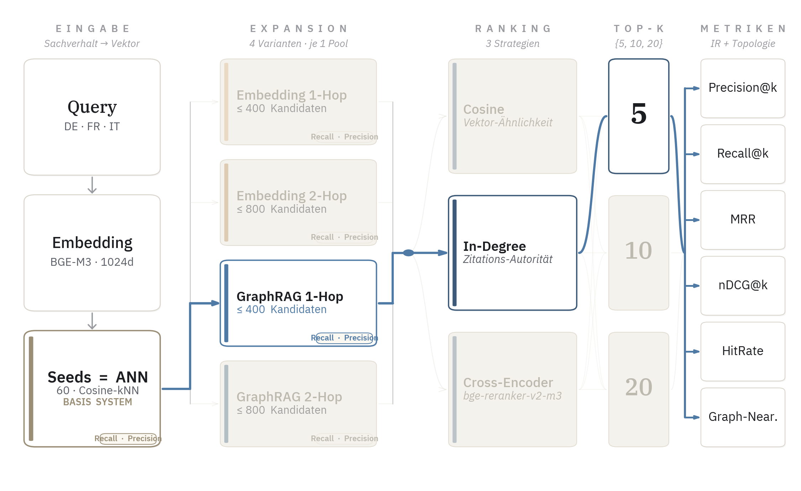
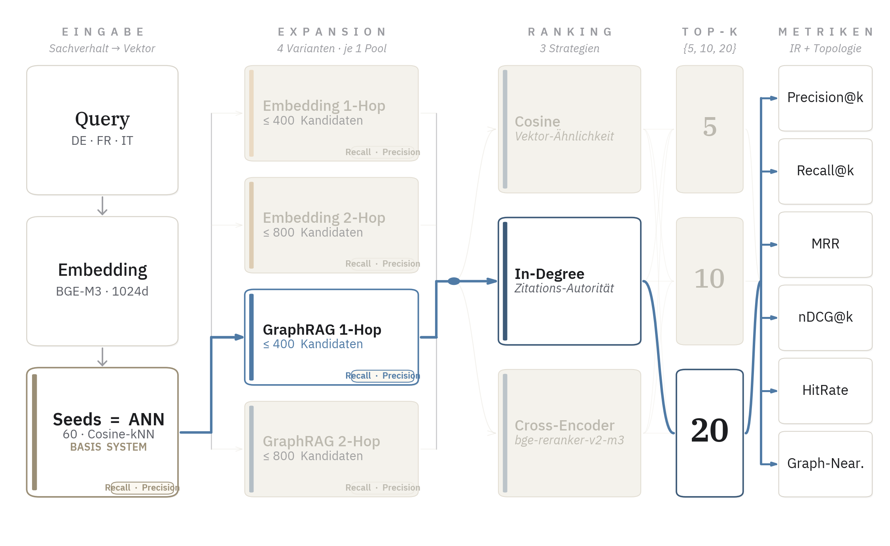

# Resultate

## Datengrundlage

Evaluiert wurden 12'678 Queries (4'226 je Amtssprache) gegen fünf Retrieval-Systeme, RAG, Embedding-1Hop, Embedding-2Hop, GraphRAG-1Hop und GraphRAG-2Hop, mit jeweils drei Ranking-Strategien (Cosine, In-Degree, Cross-Encoder) bei vier top-k-Werten (5, 10, 15, 20). Insgesamt liegen 60 Konfigurationen (System × Ranking × k) mit voller Per-Query-Tiefe vor. Sämtliche Zahlen wurden mit der in Kapitel 3 beschriebenen bereinigten Pipeline berechnet (Self-Exclusion am Seed-Schritt, temporaler Closed-World-Filter mit `date_ms`-Range, strikter Ground-Truth-Filter $I_{\text{valid}}$).

Statistische Absicherung. Für die in der Diskussion aufgegriffenen Headline-Verhältnisse zwischen den Systemen werden 95-%-Konfidenzintervalle aus einem nicht-parametrischen Bootstrap mit 10'000 Resamples auf der Per-Query-Ebene berichtet. Für Verhältnisse zwischen zwei Systemen kommt gepaartes Resampling zum Einsatz, weil dieselbe Query-Menge alle Systeme durchläuft. Die einzelnen Tabellenwerte werden als Mittelwert ohne CI angegeben, weil die CI-Breiten bei $n = 12'678$ durchgängig unter einem Prozentpunkt liegen und die Tabellen sonst unübersichtlich würden.

Beschränkung auf Entscheid-Retrieval. Der zugrundeliegende SCALE-Datensatz erlaubt zwei Retrieval-Aufgaben, das Retrieval zitierter Gerichtsentscheide (cited_rulings) und das Retrieval zitierter Gesetzesartikel (laws). Die vorliegende Auswertung beschränkt sich auf die erste Aufgabe. Der Qdrant-Index wird beim Retrieval auf die Sources `swiss_rulings_chunked` und `swiss_leading_decisions_chunked` gefiltert, Gesetze werden weder retrievt noch in den Metriken berücksichtigt (`ground_truth_laws` wird erfasst, aber nicht ausgewertet). Diese Beschränkung ist methodisch konsistent, weil Urteile-zu-Urteile-Matching auf beiden Seiten der Metrik klarer interpretierbar bleibt als ein Mix aus heterogenen Dokumenttypen. Die Gesetzesretrieval-Aufgabe wird als Future Work in Kapitel 7 benannt und ist mit dem bestehenden Pipeline-Gerüst mit geringem Aufwand nachziehbar.

Aufschlüsselung nach Gerichtsebene entfällt. Die in Kapitel 1 angekündigte Aufschlüsselung nach Gerichtsebene (Bundesgericht, Kantonal, Regional) wird im finalen Lauf nicht berichtet. Sowohl der Query-Korpus als auch die zitierten Entscheide des Doc2Doc-IR-Datensatzes stammen ausschliesslich vom Bundesgericht. Eine Gerichtsebenen-Achse ist auf dieser Datengrundlage nicht definiert und wird in Kapitel 7 als Erweiterungsmöglichkeit für eine breitere Korpusversion benannt.

## Pool-Qualität, Recall- und Precision-Ceiling

{ width=95% }

Vor jedem Ranking-Schritt steht die Kandidatengenerierung. Recall-Ceiling und Precision-Ceiling werden auf der `post_cap`-Stufe gemessen (nach temporalem Filter und Pool-Cap, also dem Pool den das Ranking tatsächlich sieht). Die RAG-Baseline besitzt nur die Seed-Stufe und wird mit ihren 60 Seeds berichtet.

| System | Pool-Grösse | Recall-Ceiling | Precision-Ceiling |
|---|---:|---:|---:|
| RAG (Baseline) | 60 | 2.30 % | 0.116 % |
| Embedding-1Hop | 421 | 3.38 % | 0.031 % |
| Embedding-2Hop | 804 | 4.19 % | 0.020 % |
| **GraphRAG-1Hop** | **180** | **47.4 %** | **1.26 %** |
| GraphRAG-2Hop | 826 | 51.7 % | 0.28 % |

Table: Pool-Qualität pro Architektur (Recall- und Precision-Ceiling, post-cap-Stufe).

GraphRAG-1Hop liegt mit 47.4 % Recall-Ceiling rund Faktor 14 (gepaarter Bootstrap-CI 13.1 bis 15.1) über Embedding-1Hop, und das bei kleinerem Pool. Beide Systeme starten aus demselben 60-Seed-Cosine-Pool und durchlaufen identische Filter, sie unterscheiden sich nur in der Expansionsoperation (kNN-Suche versus `successors` im Graphen). Der RAG-Precision-Ceiling-Wert von 0.116 % ist ein Artefakt des kleinen Pools, absolut enthält RAG im Mittel nur 0.07 GT-Treffer pro Query gegenüber 2.3 bei GraphRAG-1Hop. Der zweite Traversierungs-Hop vergrössert den Pool um Faktor 4.6, hebt das Recall-Ceiling aber nur um 4.3 Prozentpunkte und reduziert das Precision-Ceiling um Faktor 4.5 — er verdünnt die Pool-Qualität, ohne substanziell neue GT-Treffer beizutragen.

## In-Degree-Ranking (primäre Vergleichsmetrik)

Nach dem Ranking-Schritt zeigt sich, welcher Anteil der im Pool enthaltenen Ground Truth in die Top-k-Liste übertragen wird. In-Degree ist die Ranking-Strategie, unter der die GraphRAG-Architektur ihren stärksten gemessenen Vorteil entfaltet. Berichtet werden zwei Stützpunkte, $k=5$ als operativer Sweet Spot mit der höchsten Precision und der höchsten F1, und $k=20$ als Recall-orientierte Konfiguration mit der höchsten HitRate und dem höchsten MRR.

### k=5, höchste Precision und F1

{ width=95% }

| System | Recall@5 | Precision@5 | HitRate | MRR | NDCG | Nearness |
|---|---:|---:|---:|---:|---:|---:|
| **GraphRAG-1Hop** | **0.116** | **0.0951** | **0.327** | 0.220 | 0.136 | **0.363** |
| GraphRAG-2Hop | 0.115 | 0.0947 | 0.325 | 0.219 | 0.136 | 0.364 |
| Embedding-2Hop | 0.026 | 0.0174 | 0.076 | 0.052 | 0.029 | 0.143 |
| Embedding-1Hop | 0.023 | 0.0159 | 0.069 | 0.049 | 0.027 | 0.131 |
| RAG (Baseline) | 0.021 | 0.0132 | 0.057 | 0.048 | 0.027 | 0.092 |

Table: In-Degree-Ranking bei k=5, Metriken pro Architektur.

GraphRAG-1Hop erreicht hier den höchsten F1-Wert (10.4 %) über alle 60 Konfigurationen und ist damit die natürliche Wahl für Produktivsysteme, die kurze hochwertige Trefferlisten präsentieren. Eine HitRate von 32.7 % bedeutet, dass auch bei nur fünf zurückgegebenen Entscheiden in rund einem Drittel der Queries mindestens ein korrekter zitierter Entscheid dabei ist.

### k=20, höchste HitRate und MRR

{ width=95% }

| System | Recall@20 | Precision@20 | HitRate | MRR | NDCG | Nearness |
|---|---:|---:|---:|---:|---:|---:|
| **GraphRAG-1Hop** | **0.239** | **0.0516** | **0.515** | **0.239** | **0.170** | 0.313 |
| GraphRAG-2Hop | 0.226 | 0.0496 | 0.495 | 0.236 | 0.165 | 0.315 |
| Embedding-2Hop | 0.036 | 0.0060 | 0.095 | 0.054 | 0.030 | 0.085 |
| Embedding-1Hop | 0.031 | 0.0052 | 0.083 | 0.050 | 0.027 | 0.077 |
| RAG (Baseline) | 0.023 | 0.0035 | 0.058 | 0.048 | 0.025 | 0.061 |

Table: In-Degree-Ranking bei k=20, Metriken pro Architektur.

GraphRAG-1Hop liefert 10.4-fach höheren Recall als RAG (gepaarter Bootstrap-CI 9.5 bis 11.5) und 7.7-fach höheren Recall als Embedding-1Hop (CI 7.2 bis 8.4), und das mit kleinerer Pool-Grösse. Die HitRate von 51.5 % bedeutet einen korrekten zitierten Entscheid in den Top-20 für jede zweite Query, bei mittlerer GT-Grösse von 4.77 und Korpus von rund 131'000 Entscheiden ein operativ relevantes Niveau. Auch der direkte 2-Hop-Vergleich (Embedding-2Hop versus GraphRAG-2Hop bei identischem Pool-Cap) bestätigt die Forschungshypothese auf der Ranking-Ebene.

### Leitentscheid-Ausrichtung als struktureller Confound

Ein struktureller Confound im Ranking-Vergleich ist die Leitentscheid-Ausrichtung des In-Degree-Signals. Eine Stichprobenprüfung auf 200 Queries zeigt 99.0 % Leitentscheid-Anteil an Position 1 der Top-5 unter GraphRAG-1Hop In-Degree. Die ausführliche Diskussion dieses Effekts als Label-Confound folgt in Kapitel 6.

### Konvergenz von 1-Hop und 2-Hop

Auffällig ist die enge Übereinstimmung zwischen GraphRAG-1Hop und GraphRAG-2Hop. Bei $k=20$ liegen sie 1.3 Prozentpunkte Recall auseinander, bei $k=5$ sind sie identisch. Da 2Hop dafür einen 4.6-fach grösseren Pool aufruft, ist GraphRAG-1Hop für Produktivumgebungen klar zu bevorzugen. Die hohen Graph-Nearness-Werte beider GraphRAG-Systeme (0.31 bei $k=20$, 0.36 bei $k=5$, gegenüber 0.06 bzw. 0.09 bei RAG) zeigen, dass auch ihre Fehler topologisch nah an der Ground Truth liegen, vertieft in der nachfolgenden Diagnose-Sektion.

## Cross-Encoder-Ranking @ k=10

Die zweite primär geplante Vergleichsachse bewertet die Kandidaten anhand semantischer Paar-Relevanz durch den Cross-Encoder `BAAI/bge-reranker-v2-m3`. Die folgende Tabelle berichtet die Metriken bei $k=10$.

| System | Recall@10 | Precision@10 | HitRate | MRR | NDCG | Nearness |
|---|---:|---:|---:|---:|---:|---:|
| **GraphRAG-1Hop** | **0.0147** | **0.0048** | **0.0441** | 0.0136 | 0.0098 | 0.081 |
| GraphRAG-2Hop | 0.0143 | 0.0048 | 0.0443 | 0.0134 | 0.0095 | 0.084 |
| RAG (Baseline) | 0.0069 | 0.0019 | 0.0171 | 0.0065 | 0.0048 | 0.057 |
| Embedding-1Hop | 0.0047 | 0.0012 | 0.0115 | 0.0044 | 0.0033 | 0.050 |
| Embedding-2Hop | 0.0041 | 0.0011 | 0.0103 | 0.0040 | 0.0030 | 0.046 |

Table: Cross-Encoder-Ranking bei k=10, Metriken pro Architektur.

Der relative Architekturvergleich bleibt qualitativ konsistent mit dem In-Degree-Befund (GraphRAG-1Hop führt, gefolgt von 2Hop). Bemerkenswert ist die Inversion bei RAG und Embedding, die RAG-Baseline liegt unter Cross-Encoder knapp über den Embedding-Systemen — die zusätzlich expandierten Pools enthalten Rauschen, das der Encoder nicht zuverlässig wegsortiert, während er auf den 60 RAG-Seeds eine dichtere Vorauswahl hat. Quantitativ liegt das absolute Niveau jedoch eine Grössenordnung unter dem In-Degree-Ranking (4.41 % HitRate gegenüber 51.5 %), die Ursache wird in der Ranking-Strategien-Diskussion weiter unten aufgegriffen.

## Mechanistische Lesart der Absolutwerte

Die für die Hauptkonfiguration (GraphRAG-1Hop, In-Degree, $k=20$) berichteten Werte (MRR 0.239, NDCG 0.170, Recall@20 0.239 bei HitRate 51.5 %) lassen sich konsistent mit der HitRate zerlegen. Der bedingte MRR im Erfolgsfall liegt bei $0.239 / 0.515 \approx 0.464$, was einer durchschnittlichen ersten Trefferposition von rund 2 entspricht. Der bedingte Recall im Erfolgsfall liegt bei $0.239 / 0.515 \approx 46\,\%$, bei mittlerer GT-Grösse von 4.77 also rund 2.2 der vier bis fünf gesuchten Entscheide in den Top-20. NDCG@20 ist durch das beschränkte Recall-Niveau nach oben gedeckelt und reflektiert die Distanz zwischen tatsächlicher und optimaler Ranking-Verteilung.

Die Kandidatengenerierung liefert die zitierten Entscheide also in etwa der Hälfte der Fälle in den Pool (Recall-Ceiling 47.4 %), das nachgelagerte In-Degree-Ranking holt davon einen substanziellen Teil in die Top-20 zurück (ranked Recall 23.9 %), und es platziert den ersten Treffer im Erfolgsfall auf rund Position 2. Die Lücke zwischen Pool-Recall-Ceiling und ranked Recall liegt bei Faktor 2, ein Reranker-Ansatz mit besserer Ausnutzung des verfügbaren Pools würde an dieser Lücke ansetzen.

## Aufschlüsselung nach Sprache

Die folgende Tabelle berichtet die zentrale GraphRAG-1Hop-Konfiguration (In-Degree, $k=20$) aufgeschlüsselt nach den drei Amtssprachen. Pro Sprache liegen 4'226 Queries vor.

| Sprache | n | Recall@20 | Precision@20 | HitRate | Nearness |
|---|---:|---:|---:|---:|---:|
| Deutsch | 4'226 | 0.276 | 0.0509 | 0.534 | 0.313 |
| Französisch | 4'226 | 0.217 | 0.0498 | 0.487 | 0.323 |
| Italienisch | 4'226 | 0.224 | 0.0541 | **0.526** | 0.302 |

Table: GraphRAG-1Hop unter In-Degree-Ranking bei k=20, pro Amtssprache.

Die Architektur ist in allen drei Sprachen konsistent wirksam, alle Amtssprachen erreichen HitRates zwischen 48.7 und 53.4 Prozent. Im Recall liegt Deutsch vorne, anteilsmässig erklärbar durch die kleinste mittlere GT-Grösse (4.41 gegenüber 4.79 Französisch und 5.11 Italienisch).

Der Cross-Encoder-Pfad zeigt dagegen ein deutliches Sprachgefälle (Deutsch 7.3 % HitRate, Französisch 4.2 %, Italienisch 1.7 % bei $k=10$). Der multilinguale Reranker ist auf Schweizer Rechtstexten sprachabhängig kalibriert, vermutlich weil deutschsprachiges juristisches Trainingsmaterial im Modell besser repräsentiert ist. Im In-Degree-Pfad, der den Text nicht direkt bewertet, fehlt dieser Effekt.

## Cosine-Ranking

Cosine-Ranking sortiert die Kandidaten ausschliesslich nach Cosine-Ähnlichkeit zum Query-Embedding. Da Embedding- und Graph-Expansion-Kandidaten keinen direkten Cosine-Score gegenüber der Query besitzen, sind die berichteten Werte unter dieser Ranking-Strategie für alle Systeme identisch und entsprechen dem RAG-Top-k aus den 60 ANN-Seeds. Recall@10 liegt durchgängig bei 0.0088, HitRate bei 2.33 %. Cosine-Ranking trennt damit empirisch nicht zwischen den Architekturen, was nicht überraschend ist, da die Voruntersuchungen aus Kapitel 3 bereits gezeigt hatten, dass die Cosine-Ähnlichkeitsdifferenz zwischen zitierten und zufälligen Entscheiden im verwendeten BGE-M3-Embedding-Raum unter 0.001 liegt. Cosine-Ranking wird der Vollständigkeit halber berichtet, um die in Kapitel 3 diskutierte Limitierung empirisch zu belegen, dient aber nicht als Vergleichsstrategie zwischen den Systemen.

## Ranking-Strategien im Vergleich

Die zwei aussagekräftigen Ranking-Strategien (In-Degree und Cross-Encoder) zeigen ein konsistentes, aber quantitativ stark divergierendes Bild. In-Degree liefert für GraphRAG-1Hop einen um den Faktor 11 höheren Recall@10 (16.7 % gegenüber 1.5 %) und eine um den Faktor 9 höhere HitRate (41.6 % gegenüber 4.4 %) als Cross-Encoder, ein Befund, der mit der gängigen Empfehlung, dass Cross-Encoder einfache Sortierheuristiken schlagen, auf den ersten Blick kollidiert.

Mechanistisch ist die Ursache erklärbar. Der Cross-Encoder bewertet jedes (Query, Dokument)-Paar nach topischer Sachverhalts-Nähe, er misst, wie ähnlich die Texte semantisch sind. Im juristischen Zitationskontext ist dies jedoch nicht das relevante Signal, Bundesgerichtsentscheide zitieren in erster Linie autoritative Präjudizien, die einen einschlägigen Rechtsgrundsatz formulieren, auch wenn der Sachverhalt faktisch verschieden ist. Ein Vertragsrechtsfall kann einen Leitentscheid aus dem Sachenrecht zitieren, weil dort der allgemeine Treu-und-Glauben-Grundsatz formuliert wurde, semantisch sind beide Texte sehr unterschiedlich, juristisch eng verknüpft. In-Degree erfasst Autorität direkt (häufig zitierte Entscheide sind Leitentscheide), und Autorität korreliert mit Zitationswahrscheinlichkeit stärker als topische Ähnlichkeit. Das Ergebnis bestätigt damit auf der Ranking-Ebene, was die zitierte Vorliteratur theoretisch erwartet hatte [@milzAnalysisGermanLegal2021, S. 4; @sternCitationsCriticality2024, S. 2-3], im Legal-IR-Kontext sind netzwerkbasierte Autoritätsmasse stärkere Relevanzindikatoren als rein semantische Modelle.

## Graph-Nearness als Diagnose-Metrik

Graph-Nearness (GN) misst die durchschnittliche topologische Nähe $1/(1+d)$ retrievierter Dokumente zur nächstgelegenen Ground Truth. Sie dient hier als Diagnose des Fehlermusters, nicht als Qualitäts-Vergleich (höhere GN-Werte für GraphRAG sind per Konstruktion erwartbar). Aussagekräftiger als der Mittelwert ist die unterliegende Verteilung der Retrieved-zu-GT-Distanzen.

| System | d = 0 (exakt) | d = 1 | d = 2 | d > 2 / kein Pfad | GN |
|---|---:|---:|---:|---:|---:|
| RAG (Baseline) | 0.35 % | 10.26 % | 1.77 % | 87.63 % | 0.061 |
| Embedding-1Hop | 0.52 % | 9.21 % | 7.88 % | 82.40 % | 0.077 |
| Embedding-2Hop | 0.60 % | 8.44 % | 11.09 % | 79.86 % | 0.085 |
| **GraphRAG-1Hop** | **5.16 %** | **0.14 %** | **78.16 %** | **16.54 %** | **0.313** |
| GraphRAG-2Hop | 4.96 % | 0.13 % | 79.40 % | 15.50 % | 0.315 |

Table: Verteilung der Retrieved-zu-GT-Distanzen unter In-Degree-Ranking bei k=20.

Die GraphRAG-Verteilung konzentriert sich zu rund 78 Prozent auf den 2-Hop-Bucket, eine direkte Konsequenz der Pool-Konstruktion (Seeds sind typischerweise 1-Hop von der Ground Truth entfernt, ihre Nachbarn entsprechend 2-Hop). Embedding und RAG sammeln ihre Treffer dagegen überwiegend im Far-Bucket, ihr 1-Hop-Anteil von 8-10 Prozent zeigt aber, dass semantische Nähe einen schwachen Bezug zur Zitations-Topologie hat. Der exakte Treffer-Anteil bei GraphRAG (5 Prozent) liegt zehnmal höher als bei RAG, konsistent mit der zehnfach höheren ranked Recall.

Praktisch heisst das, ein GraphRAG-Fehltreffer (GN 0.31, ≈2 Hops) liegt strukturell im relevanten Bereich des Graphen und ist für die juristische Recherche oft verwertbar (gemeinsam zitierte oder denselben Rechtsgrundsatz behandelnde Urteile), während ein RAG-Fehltreffer (GN 0.06) typischerweise unverbunden zur Ground Truth ist.

## Einordnung

Der Gesamtbefund ist konsistent über alle Vergleichsachsen. Im Pool dominiert GraphRAG-1Hop mit einer Recall-Ceiling von 47.4 % gegenüber 3.4 % bei Embedding-1Hop. Auf der Ranking-Ebene überträgt sich dieser Vorteil in eine HitRate von 51.5 % und einen Recall@20 von 23.9 % unter In-Degree-Ranking. GraphRAG-2Hop bringt keinen substanziellen Mehrwert. Die zentrale Forschungshypothese, dass zitationsbasierter GraphRAG die Retrieval-Qualität gegenüber Standard-RAG und gegenüber semantischer Pool-Erweiterung verbessert, ist damit auf allen drei sauberen Vergleichsachsen (Pool-Recall-Ceiling, Pool-Precision-Ceiling, ranked Recall@k) belegt. Die absoluten Recall-Werte (23.9 %) sind im Kontext zu lesen, gesucht werden im Mittel 4.8 zitierte Entscheide in einem Korpus von 131'734 zulässigen, im Erfolgsfall platziert das System den ersten Treffer auf rund Position 2.
